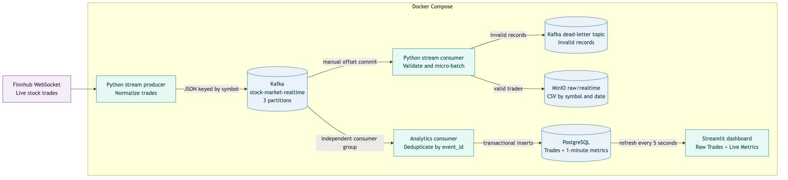

# Real-Time Stock Market Data Platform

An open-source streaming data project that collects live stock trades, moves
them through Kafka, archives raw events in MinIO, and serves live analytics
through PostgreSQL and Streamlit.

## Current architecture



```text
Finnhub WebSocket
        ↓
Python producer
        ↓
Kafka
   ├── Raw archive consumer → MinIO
   ├── Invalid records → Dead-letter topic
   └── Analytics consumer → PostgreSQL → Streamlit
```

## Current components

- **Finnhub WebSocket** provides live stock trades.
- **Python producer** normalizes trades and publishes idempotently to Kafka.
- **Kafka** buffers events and supports replay.
- **Python consumer** validates trades and writes valid micro-batches to MinIO.
- **Dead-letter topic** stores invalid records with their error details.
- **MinIO** stores the replayable raw event archive.
- **Analytics consumer** stores deduplicated trades in PostgreSQL.
- **PostgreSQL** calculates live one-minute trading metrics.
- **Streamlit** displays raw trades and live metrics with five-second refreshes.
- **Docker Compose** runs the local platform.

## Project structure

```text
src/kafka/
├── Dockerfile
├── requirements.txt
├── producer/
│   └── stream_producer.py
└── consumer/
    ├── stream_data_consumer.py
    └── analytics_consumer.py

src/dashboard/
├── app.py
├── database.py
└── pages/
    ├── raw_trades.py
    └── live_metrics.py

docs/
├── architecture/
│   └── current_streaming_flow.png
├── streaming_ingestion.md
└── project_explanation.md

tests/
├── test_trade_processing.py
└── test_postgres_pipeline.py
```

## Configuration

Copy `.env.example` to `.env` and provide a Finnhub API key:

```bash
cp .env.example .env
```

```env
FINNHUB_API_KEY="your-key"
```

Do not commit `.env`.

## Run

1. Activate the local virtual environment:

```bash
source .venv/bin/activate
```

2. Stop any existing containers:

```bash
docker compose down
```

3. Build and start the complete platform:

```bash
docker compose up -d --build
```

4. Run the automated end-to-end validation:

```bash
./tests/run_e2e.sh
```

5. Follow producer and consumer activity:

```bash
docker compose logs -f stream-producer stream-consumer analytics-consumer
```

Press `Ctrl+C` to stop following logs. The containers continue running.

6. Open the user interfaces:

- Streamlit dashboard: `http://localhost:8501`
- MinIO console: `http://localhost:9001`

The end-to-end script also runs all unit and integration tests. A successful
run finishes with `END-TO-END TEST PASSED`.

Useful commands:

```bash
docker compose ps
docker compose down
```

## Local endpoints

- MinIO console: `http://localhost:9001`
- MinIO API: `http://localhost:9002`
- PostgreSQL: `localhost:5433`
- Kafka from the host: `localhost:29092`
- Streamlit dashboard: `http://localhost:8501`

## Current delivery semantics

The producer uses Kafka idempotence and `acks=all`. The consumer disables
automatic commits and follows:

```text
consume → write to MinIO → commit Kafka offset
```

Raw object names include Kafka partition and offset ranges. Replaying a
micro-batch therefore overwrites the same MinIO object instead of creating a
duplicate.

The analytics consumer commits offsets after the PostgreSQL transaction.
`event_id` is the primary key, so replayed trades are ignored.

## Implementation phases

- Phase 1: streaming-only cleanup and platform foundation — complete
- Phase 2: explicit Kafka topics, partitions, validation and dead-letter topic — complete
- Phase 3: PostgreSQL analytics consumer and one-minute metrics — complete
- Phase 4: two-page continuously refreshing Streamlit dashboard — complete
- Phase 5: tests, observability and production documentation — complete
